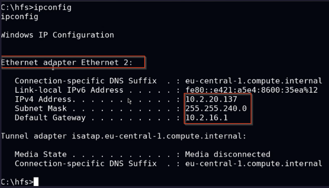

# Enumeracion de la red



### Conocer adaptadores de red y las IPs

<figure><figcaption></figcaption></figure>



### Conocer la dirección mac y más información

```bash
ipconfig /all
```



<figure><figcaption></figcaption></figure>

### Conocer enrutamiento direcciones IP

```bash
route print
```



<figure><figcaption></figcaption></figure>

### Conocer equipos conectados a nuestra red

```bash
arp -a
```

<figure><figcaption></figcaption></figure>



### Conocer puertos abiertos

```bash
netstat -ano
```

<figure><figcaption></figcaption></figure>


