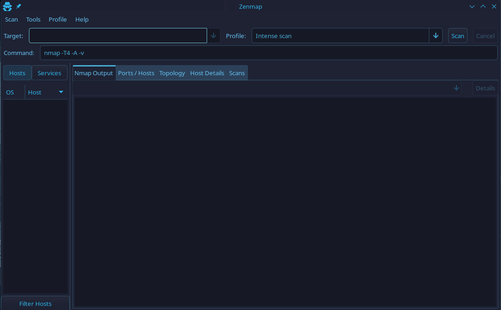

# Nmap

## Sintaxis básica

```bash
nmap [ip]
# Ejemplo nmap 192.168.1.1
```

### Escaneo de puertos

#### Puertos específicos

```bash
nmap -p [puerto o puertos separados por comas] [ip]
# Ejemplo: nmap -p 22,80 192.168.1.1
```

#### Rango de puertos

```bash
nmap -p 1-65535 [ip]
# o para un escaneo mas rapido de todos los puertos
nmap -p- --min-rate 1000 [ip]
```

### Detección de versiones de servicios

#### Detección de versión

```bash
nmap -sV [ip]
```

#### Detección de sistema operativo

```bash
nmap -O [ip]
```

#### Detección del sistema operativo y versión

```bash
nmap -A [ip]
```

### Escaneo de múltiples objetivos

```bash
nmap [ip] [ip]
```

#### Escaneo de rangos de IP&#x20;

```bash
nmap [ip]/[mascara de red]
# Ejemplo
nmap 192.168.1.1/24
```

#### Escaneo de lista de IP

```bash
nmap -iL ips.txt
```

### Formatos de salida

```bash
nmap -oN output.txt # Archivo txt 
nmap -oN output.xml # Archivo XML
nmap -oG salida.gnmap # Archivo Grepable
```

### Scripts NSE

Los scripts NSE sirven para detectar vulnerabilidades, hacer fuerza bruta o enumerar usuarios automaticamente.

#### Lista de scripts

```bash
ls /usr/share/nmap/scripts/
```

#### Ejecutar script

```bash
nmap --script [nombre-script] [ip]
# Ejemplo
nmap --script http-title 192.168.1.234
```

#### Ejecutar categoria de scripts

```bash
nmap --script [nombre-categoria] [ip]
# Ejemplo
nmap --script vuln 192.168.1.231
```

### Técnica de evasión

#### Sondeo TCP ACK (Detectar tipo de Firewall)

Con la opcion -sA podemos detectar el tipo de firewall:

```
nmap -sA <ip>
```

#### Velocidad de escaneo

El parámetro <kbd>-T</kbd> permite cambiar la velocidad de escaneo en un rango del 0 al 5 siendo el 5 la opción mas rápida y agresiva, para evadir sistemas de protección la velocidad tiene que ser lo mas baja posible.

```bash
nmap -T3 [ip]
```

#### Fragmentación de paquetes

```bash
nmap -f [ip]
```

#### Cambiar puerto de origen

```bash
nmap --source-port [puerto] [ip]
```

#### Spoofing de IP&#x20;

```bash
nmap -S [ip-a-utilizar] [ip]
```

#### Decoys

Sirve para confundir el firewall indicando direcciones IP señuelo, disimulando el análisis:

```bash
nmap -D [ip-falsa],[ip-falsa],[ip-falsa],[ip-real]
```

### --script-mpu

El parámetro mpu sirve para ajustar el tamaño máximo de paquete sin fragmentar (MPU) para los paquetes enviados durante las pruebas de detección de firewall. Debe ponerse siempre un número múltiplo de 8 (8, 16, ...):

### --spoof-mac (cambiar MAC)

Con la opción --spoof-mac podremos cambiar la MAC

### Escaneo sigiloso

#### Syn Scan

```bash
nmap -sS [ip]
```

#### TCP Scan

```bash
nmap -sT [ip]
```

#### UDP Scan

```bash
nmap -sUV [ip]
```

### CÓMO HACER UN ESCANEO DE NMAP MUCHO MÁS RÁPIDO Y EFICIENTE

* Ponemos triple verbose para ver resultados mientras analiza.
* -n evita la resolución DNS.
* \--min-rate acelera.
* -Pn evita comprobación de ping previa.
* -oN / -oG para exportar resultados.

Ejemplo:

```bash
nmap -p- --open -sS -sC -sV --min-rate 5000 -vvv -n -Pn 10.10.11.191 -oN escaneo
```

## Interfaz gráfica de Nmap (Zenmap)

Zenmap es la interfaz gráfica de nmap:

<figure><figcaption></figcaption></figure>

También se pueden crear y usar perfiles con objetivos y parámetros guardados.
