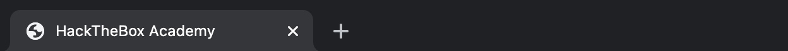

# Defacing

Ahora que comprendemos los diferentes tipos de XSS y los diversos métodos para descubrir vulnerabilidades XSS en páginas web, podemos empezar a aprender a explotarlas. Como se mencionó anteriormente, el daño y el alcance de un ataque XSS dependen del tipo de XSS: un XSS almacenado es el más crítico, mientras que uno basado en DOM lo es menos.

Uno de los ataques más comunes que se suelen usar con vulnerabilidades XSS almacenadas son los ataques de desfiguración de sitios web. Desfigurar (defacing) un sitio web significa cambiar su apariencia para cualquiera que lo visite. Es muy común que grupos de hackers desfiguren un sitio web para afirmar haberlo hackeado con éxito, como ocurrió cuando hackers desfiguraron el Servicio Nacional de Salud (NHS) del Reino Unido en 2018. https://www.bbc.co.uk/news/technology-43812539 Estos ataques pueden tener gran repercusión mediática y afectar significativamente las inversiones y el precio de las acciones de una empresa, especialmente de bancos y empresas tecnológicas.

Aunque se pueden utilizar muchas otras vulnerabilidades para lograr lo mismo, las vulnerabilidades XSS almacenadas se encuentran entre las más utilizadas para hacerlo.

Elementos de desfiguración

Podemos usar código JavaScript inyectado (mediante XSS) para que una página web tenga el aspecto que queramos. Sin embargo, desfigurar un sitio web suele usarse para enviar un mensaje simple (por ejemplo, "te hackeamos con éxito"), por lo que darle a la página web desfigurada un aspecto atractivo no es realmente el objetivo principal.

Generalmente se utilizan cuatro elementos HTML para cambiar el aspecto principal de una página web:

* Color de fondo: document.body.style.background
* Fondo (imagen): document.body.background
* Título de la página: document.title
* Texto de la página: DOM.innerHTML

Podemos utilizar dos o tres de estos elementos para escribir un mensaje básico a la página web e incluso eliminar el elemento vulnerable, de forma que sería más difícil restablecer rápidamente la página web, de la forma que veremos a continuación.



### Cambio de fondo

Regresemos a nuestro ejercicio de Stored XSS y utilicémoslo como base para nuestro ataque. Puedes regresar a la sección Stored XSS para generar el servidor y seguir los siguientes pasos.

Para cambiar el fondo de una página web, podemos elegir un color específico o usar una imagen. Usaremos un color como fondo, ya que la mayoría de los ataques de desfiguración usan un color oscuro. Para ello, podemos usar la siguiente carga útil:


```html
<script>document.body.style.background = "#141d2b"</script>
```



Aquí configuramos el color de fondo predeterminado de Hack The Box. Podemos usar cualquier otro valor hexadecimal o un color con nombre, por ejemplo: "black".


Una vez que agregamos nuestra carga útil a la To-Do lista, veremos que el color de fondo cambió:


Esto persistirá durante las actualizaciones de página y aparecerá para cualquiera que visite la página, ya que estamos utilizando una vulnerabilidad XSS almacenada.

Otra opción sería establecer una imagen de fondo utilizando la siguiente carga útil:


```html
<script>document.body.background = "https://www.hackthebox.eu/images/logo-htb.svg"</script>
```


Intente utilizar la carga útil anterior para ver cómo podría verse el resultado final.



### Cambiar el título de la página

Podemos cambiar el título de la página "2Do" a cualquier título que elijamos, utilizando la propiedad document.title de JavaScript:


```html
<script>document.title = 'HackTheBox Academy'</script>
```


Podemos ver desde la ventana/pestaña de la página que nuestro nuevo título ha reemplazado al anterior:





### Cambiar el texto de la página

Para cambiar el texto que se muestra en la página web, podemos utilizar diversas funciones de JavaScript. Por ejemplo, cambiar el texto de un elemento HTML/DOM específico mediante innerHTML:


```javascript
document.getElementById("todo").innerHTML = "New Text"
```


También podemos utilizar funciones jQuery (si la página carga jQuery):


```javascript
$("#todo").html('New Text');
```


Para reemplazar todo el contenido HTML del body y mostrar un mensaje personalizado, podemos usar:


```javascript
document.getElementsByTagName('body')[0].innerHTML = "New Text"
```


Consejo: sería prudente ejecutar el código HTML localmente para ver cómo se ve y asegurarnos de que se ejecuta como se espera antes de usarlo en una carga útil final.

Para el ejercicio, usaremos un fragmento HTML tomado de la página principal de Hack The Box Academy:


```html
<center>
    <h1 style="color: white">Cyber Security Training</h1>
    <p style="color: white">by 
        
    </p>
</center>
```


Minimizamos el HTML en una sola línea y lo añadimos a nuestra carga útil XSS:


```html
<script>document.getElementsByTagName('body')[0].innerHTML = '<center><h1 style="color: white">Cyber Security Training</h1><p style="color: white">by  </p></center>'</script>
```


Una vez que agreguemos nuestra carga útil a la To-Do lista vulnerable, veremos que nuestro código HTML ahora es parte permanente del código fuente de la página web y muestra nuestro mensaje para cualquiera que visite la página:





Observaciones sobre la inyección

Mediante el uso de tres cargas útiles XSS, logramos desfigurar con éxito nuestra página web objetivo. Si revisamos el código fuente de la página web, veremos que el código fuente original aún existe y que nuestras cargas útiles inyectadas aparecen al final:


```html
<div></div><ul class="list-unstyled" id="todo"><ul>
<script>document.body.style.background = "#141d2b"</script>
</ul><ul><script>document.title = 'HackTheBox Academy'</script>
</ul><ul><script>document.getElementsByTagName('body')[0].innerHTML = '...SNIP...'</script>
</ul></ul>
```


Esto se debe a que el código JavaScript inyectado cambia la apariencia de la página al ejecutarse (en este caso, porque se ejecuta al final del código fuente). Si la inyección se realizó en un elemento intermedio del código fuente, es posible que se agreguen otros scripts o elementos después, por lo que debemos tenerlos en cuenta para obtener la apariencia final deseada.

Sin embargo, para los usuarios normales, la página parece desfigurada y muestra nuestra nueva apariencia.
