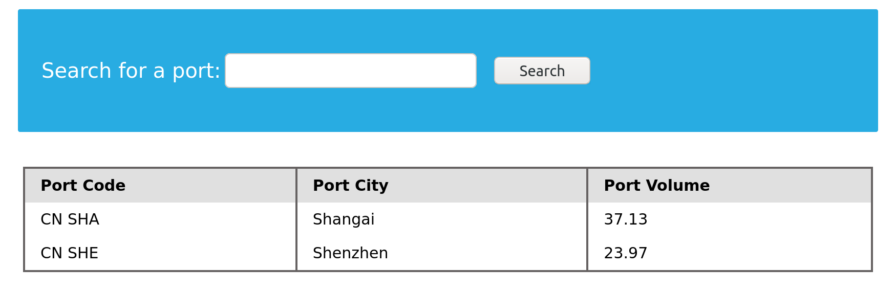
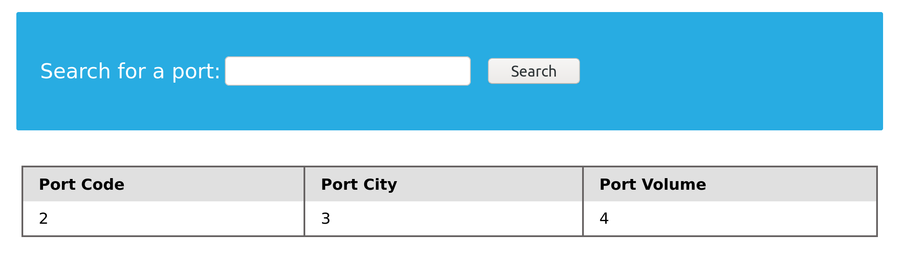

# Inyección SQL con UNION

Ahora que sabemos cómo funciona la cláusula UNION y cómo usarla, aprendamos cómo utilizarla en nuestras inyecciones SQL. Tomemos el siguiente ejemplo:



Vemos una posible inyección SQL en los parámetros de búsqueda. Aplicamos los pasos de SQLi Discovery inyectando una sola cita (`'`), y recibimos un error:


Dado que causamos un error, esto puede significar que la página es vulnerable a la inyección SQL. Este escenario es ideal para su explotación mediante inyección basada en UNION, ya que podemos ver los resultados de nuestras consultas.

***

### Detectar número de columnas

Antes de seguir adelante y explotar las consultas basadas en UNION, necesitamos encontrar la cantidad de columnas seleccionadas por el servidor. Hay dos métodos para detectarlo: usando ORDER BY o usando UNION. A continuación se muestran ambas técnicas.



### Usando ORDER BY

La primera forma de detectar el número de columnas es a través de la cláusula `ORDER BY`. Inyectamos una consulta que ordene los resultados por una columna que especifiquemos (columna 1, columna 2, etc.) hasta que obtengamos un error que indique que la columna especificada no existe.

Por ejemplo, podemos empezar con `order by 1`. Si tiene éxito, la tabla tiene al menos una columna. Luego probamos `order by 2`, `order by 3`, etc., hasta que obtengamos un error o la página deje de mostrar resultados; entonces hemos superado el número de columnas. La última columna con la que tuvimos éxito es el número total de columnas.

Ejemplo de inyección:

```sql
' order by 1-- -
```

(Recordatorio: se añade un guión adicional `-` al final para mostrar que hay un espacio después de `--`.)

Resultado esperado: no genera error y los datos se muestran normalmente.

Luego probamos:

```sql
' order by 2-- -
```

Si sigue devolviendo resultados (posiblemente reordenados), seguimos aumentando el número. En el ejemplo se probó hasta `order by 4` con éxito, pero `order by 5` devolvió el siguiente error:


Conclusión: la tabla tiene exactamente 4 columnas.



### Usando UNION

El otro método es intentar una inyección `UNION` con un número variable de columnas hasta que tengamos éxito. A diferencia de `ORDER BY` (que funciona hasta que falla), `UNION` normalmente produce errores hasta que el número de columnas coincida.

Ejemplo: probar con 3 columnas primero:

```sql
cn' UNION select 1,2,3-- -
```

Esto normalmente devuelve un error indicando que el número de columnas no coincide:


Entonces probamos con 4 columnas:

```sql
cn' UNION select 1,2,3,4-- -
```

Si la inyección es correcta veremos los resultados y sabremos que la tabla tiene 4 columnas:



Conclusión: la tabla tiene 4 columnas. Ambos métodos son válidos para determinar el número de columnas.



***

### Ubicación de la inyección

Aunque una consulta puede devolver varias columnas, es posible que la aplicación web solo muestre algunas de ellas. Si inyectamos en una columna que no se imprime en la página, no veremos el resultado. Por ello, debemos determinar qué columnas aparecen en la página para saber dónde colocar nuestra inyección.

En el ejemplo anterior, la inyección `UNION select 1,2,3,4` devolvió 1, 2, 3 y 4, pero la página solo mostró 2, 3 y 4:


Es común que algunas columnas (por ejemplo, un ID interno) no se muestren al usuario. Esto indica que las columnas 2, 3 y 4 se imprimen en la página, por lo que podemos colocar la inyección en cualquiera de ellas. No es recomendable colocar la inyección en la primera columna si su salida no se muestra, ya que no obtendremos la información.

Usar números como datos "de relleno" en la inyección facilita identificar qué columnas se muestran. Para comprobar que podemos obtener datos reales en lugar de solo números, probemos a colocar una consulta real (por ejemplo `@@version`) en una de las columnas visibles. Ejemplo:

```sql
cn' UNION select 1,@@version,3,4-- -
```

Resultado (muestra la versión de la base de datos en la columna visible correspondiente):


Ahora sabemos cómo formar nuestras cargas útiles `UNION` para imprimir con éxito el resultado de nuestras consultas en la página. En la siguiente sección se discutirá cómo enumerar la base de datos y obtener datos de otras tablas y bases de datos.
