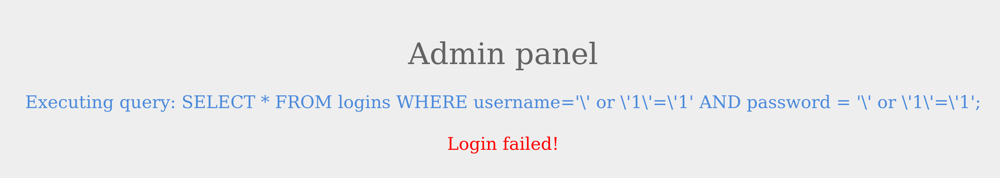

# Mitigación de la inyección SQL

Hemos aprendido sobre las inyecciones SQL, por qué ocurren y cómo podemos explotarlas. También deberíamos aprender cómo evitar este tipo de vulnerabilidades en nuestro código y aplicarles parches cuando las encontremos. Veamos algunos ejemplos de cómo se puede mitigar la inyección SQL.

***

### Sanitización de entrada

Aquí está el fragmento del código de la sección de omisión de autenticación que analizamos anteriormente:

```php
<SNIP>
  $username = $_POST['username'];
  $password = $_POST['password'];

  $query = "SELECT * FROM logins WHERE username='". $username. "' AND password = '" . $password . "';" ;
  echo "Executing query: " . $query . "<br /><br />";

  if (!mysqli_query($conn ,$query))
  {
          die('Error: ' . mysqli_error($conn));
  }

  $result = mysqli_query($conn, $query);
  $row = mysqli_fetch_array($result);
<SNIP>
```

Como podemos ver, el guión tiene en cuenta la `username` y `password` desde la solicitud POST y la pasa directamente a la consulta. Esto permitirá a un atacante inyectar todo lo que desee y explotar la aplicación. La inyección se puede evitar desinfectando cualquier entrada del usuario, lo que hace que las consultas inyectadas sean inútiles. Las bibliotecas proporcionan múltiples funciones para lograr esto, un ejemplo de ello es la [mysqli\_real\_escape\_string()](https://www.php.net/manual/en/mysqli.real-escape-string.php) función. Esta función escapa a caracteres como `'` y `"`, por lo que no tienen ningún significado especial.

```php
<SNIP>
$username = mysqli_real_escape_string($conn, $_POST['username']);
$password = mysqli_real_escape_string($conn, $_POST['password']);

$query = "SELECT * FROM logins WHERE username='". $username. "' AND password = '" . $password . "';" ;
echo "Executing query: " . $query . "<br /><br />";
<SNIP>
```

El fragmento anterior muestra cómo se puede utilizar la función.



Como era de esperar, la inyección ya no funciona debido a que se escapan las comillas simples. Un ejemplo similar es el [pg\_escape\_string()](https://www.php.net/manual/en/function.pg-escape-string.php) que solía escapar de las consultas PostgreSQL.

***

### Validación de entrada

User input can also be validated based on the data used to query to ensure that it matches the expected input. For example, when taking an email as input, we can validate that the input is in the form of `...@email.com`, and so on.

Consider the following code snippet from the ports page, which we used `UNION` injections on:

```php
<?php
if (isset($_GET["port_code"])) {
	$q = "Select * from ports where port_code ilike '%" . $_GET["port_code"] . "%'";
	$result = pg_query($conn,$q);
    
	if (!$result)
	{
   		die("</table></div><p style='font-size: 15px;'>" . pg_last_error($conn). "</p>");
	}
<SNIP>
?>
```

We see the GET parameter `port_code` being used in the query directly. It's already known that a port code consists only of letters or spaces. We can restrict the user input to only these characters, which will prevent the injection of queries. A regular expression can be used for validating the input:

```php
<SNIP>
$pattern = "/^[A-Za-z\s]+$/";
$code = $_GET["port_code"];

if(!preg_match($pattern, $code)) {
  die("</table></div><p style='font-size: 15px;'>Invalid input! Please try again.</p>");
}

$q = "Select * from ports where port_code ilike '%" . $code . "%'";
<SNIP>
```

The code is modified to use the [preg\_match()](https://www.php.net/manual/en/function.preg-match.php) function, which checks if the input matches the given pattern or not. The pattern used is `[A-Za-z\s]+`, which will only match strings containing letters and spaces. Any other character will result in the termination of the script.


We can test the following injection:

```sql
'; SELECT 1,2,3,4-- -
```


As seen in the images above, input with injected queries was rejected by the server.

***

### User Privileges

As discussed initially, DBMS software allows the creation of users with fine-grained permissions. We should ensure that the user querying the database only has minimum permissions.

Superusers and users with administrative privileges should never be used with web applications. These accounts have access to functions and features, which could lead to server compromise.

Mitigación de la inyección SQL

```shell-session
MariaDB [(none)]> CREATE USER 'reader'@'localhost';

Query OK, 0 rows affected (0.002 sec)


MariaDB [(none)]> GRANT SELECT ON ilfreight.ports TO 'reader'@'localhost' IDENTIFIED BY 'p@ssw0Rd!!';

Query OK, 0 rows affected (0.000 sec)
```

Los comandos anteriores agregan un nuevo usuario de MariaDB llamado `reader` a quien sólo se le concede `SELECT` privilegios en el `ports` tabla. Podemos verificar los permisos de este usuario iniciando sesión:

Mitigación de la inyección SQL

```shell-session
OsmanMartinez@htb[/htb]$ mysql -u reader -p

MariaDB [(none)]> use ilfreight;
MariaDB [ilfreight]> SHOW TABLES;

+---------------------+
| Tables_in_ilfreight |
+---------------------+
| ports               |
+---------------------+
1 row in set (0.000 sec)


MariaDB [ilfreight]> SELECT SCHEMA_NAME FROM INFORMATION_SCHEMA.SCHEMATA;

+--------------------+
| SCHEMA_NAME        |
+--------------------+
| information_schema |
| ilfreight          |
+--------------------+
2 rows in set (0.000 sec)


MariaDB [ilfreight]> SELECT * FROM ilfreight.credentials;
ERROR 1142 (42000): SELECT command denied to user 'reader'@'localhost' for table 'credentials'
```

El fragmento anterior confirma que `reader` El usuario no puede consultar otras tablas en el `ilfreight` base de datos. El usuario sólo tiene acceso al `ports` tabla que necesita la aplicación.

***

### Firewall de aplicaciones web

Los firewalls de aplicaciones web (WAF) se utilizan para detectar entradas maliciosas y rechazar cualquier solicitud HTTP que las contenga. Esto ayuda a prevenir la inyección SQL incluso cuando la lógica de la aplicación es defectuosa. Los WAF pueden ser de código abierto (ModSecurity) o premium (Cloudflare). La mayoría de ellos tienen reglas predeterminadas configuradas en función de ataques web comunes. Por ejemplo, cualquier solicitud que contenga la cadena `INFORMATION_SCHEMA` sería rechazado, ya que se usa comúnmente al explotar la inyección SQL.


Los WAF son una capa adicional de defensa, pero no sustituyen prácticas seguras en el código (sanitización, validación y consultas parametrizadas).


***

### Consultas parametrizadas

Otra forma de garantizar que la entrada se desinfecte de forma segura es mediante consultas parametrizadas. Las consultas parametrizadas contienen marcadores de posición para los datos de entrada, que luego los controladores escapan y transmiten. En lugar de pasar directamente los datos a la consulta SQL, utilizamos marcadores de posición y luego los llenamos con funciones PHP.

Considere el siguiente código modificado:

```php
<SNIP>
  $username = $_POST['username'];
  $password = $_POST['password'];

  $query = "SELECT * FROM logins WHERE username=? AND password = ?" ;
  $stmt = mysqli_prepare($conn, $query);
  mysqli_stmt_bind_param($stmt, 'ss', $username, $password);
  mysqli_stmt_execute($stmt);
  $result = mysqli_stmt_get_result($stmt);

  $row = mysqli_fetch_array($result);
  mysqli_stmt_close($stmt);
<SNIP>
```

La consulta se modifica para contener dos marcadores de posición, marcados con `?` donde se colocarán el nombre de usuario y la contraseña. Luego vinculamos el nombre de usuario y la contraseña a la consulta usando el [mysqli\_stmt\_bind\_param()](https://www.php.net/manual/en/mysqli-stmt.bind-param.php) función. Esto escapará de forma segura de cualquier cita y colocará los valores en la consulta.

***

### Conclusión

La lista anterior no es exhaustiva y aún podría ser posible explotar la inyección SQL basándose en la lógica de la aplicación. Los ejemplos de código que se muestran se basan en PHP, pero la lógica se aplica a todos los lenguajes y bibliotecas comunes.
