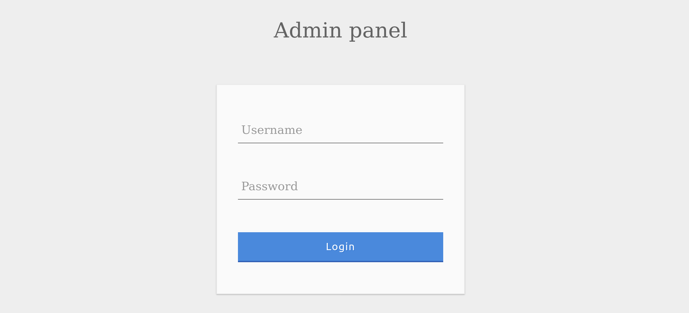
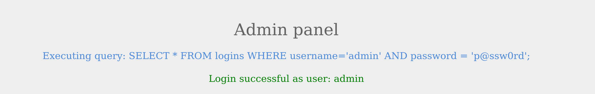
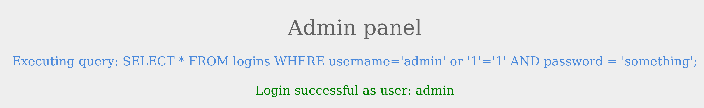
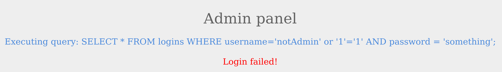
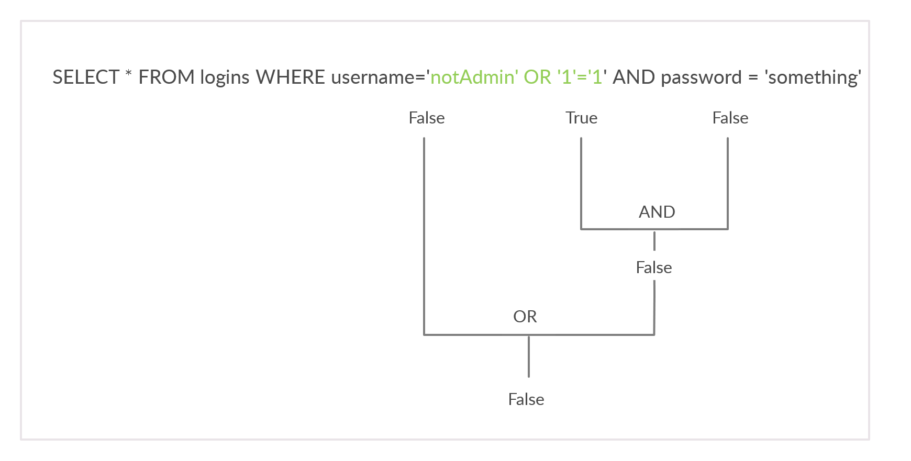
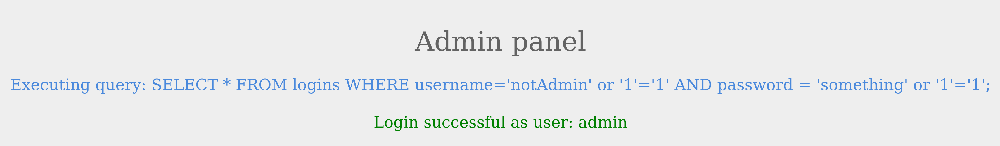
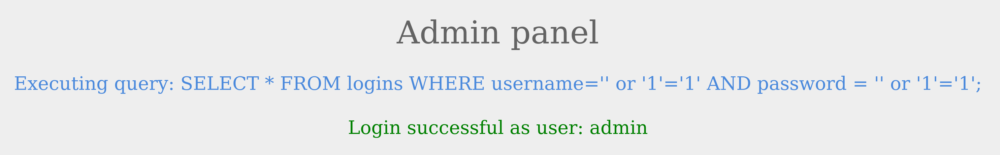

# Subvertir la lógica de consulta

Ahora que tenemos una idea básica sobre cómo funcionan las declaraciones SQL, comencemos con la inyección SQL. Antes de comenzar a ejecutar consultas SQL completas, primero aprenderemos a modificar la consulta original inyectando el operador OR y uso de comentarios SQL para subvertir la lógica de la consulta original. Un ejemplo básico de esto es eludir la autenticación web, lo que demostraremos en esta sección.

### Omisión de autenticación

Considere la siguiente página de inicio de sesión de administrador.



Podemos iniciar sesión con las credenciales del administrador `admin / p@ssw0rd`.



La página también muestra la consulta SQL que se está ejecutando para comprender mejor cómo subvertiremos la lógica de la consulta. Nuestro objetivo es iniciar sesión como usuario administrador sin utilizar la contraseña existente. Como podemos ver, la consulta SQL actual que se está ejecutando es:


```sql
SELECT * FROM logins WHERE username='admin' AND password = 'p@ssw0rd';
```


La página toma las credenciales y luego las utiliza `AND` operador para seleccionar registros que coincidan con el nombre de usuario y la contraseña indicados. Si la base de datos devuelve registros coincidentes, el código evaluaría la condición del intento de inicio de sesión como `true`. Si la condición se evalúa como `true`, se devuelve el registro de administrador y se valida nuestro inicio de sesión. Veamos qué sucede cuando ingresamos credenciales incorrectas.


Como era de esperar, el inicio de sesión falló debido a una contraseña incorrecta que generó un resultado `false` de la operación `AND`.

### Descubrimiento de SQLi

Antes de comenzar a subvertir la lógica de la aplicación web e intentar eludir la autenticación, primero tenemos que probar si el formulario de inicio de sesión es vulnerable a la inyección SQL. Para ello, intentaremos agregar una de las siguientes cargas útiles después de nuestro nombre de usuario y veremos si causa algún error o cambia el comportamiento de la página:

| Carga útil | URL codificada |
| ---------- | -------------- |
| `'`        | `%27`          |
| `"`        | `%22`          |
| `#`        | `%23`          |
| `;`        | `%3B`          |
| `)`        | `%29`          |


Nota: En algunos casos, es posible que tengamos que utilizar la versión codificada en URL de la carga útil. Un ejemplo de esto es cuando colocamos nuestra carga útil directamente en la URL, i.e. solicitud HTTP GET.


Entonces, comencemos inyectando una sola comilla:


Vemos que se arrojó un error SQL en lugar del mensaje `Login Failed`. La página arrojó un error porque la consulta resultante fue:


```sql
SELECT * FROM logins WHERE username=''' AND password = 'something';
```


Como se analizó en la sección anterior, la comilla que ingresamos resultó en un número impar de comillas, lo que provocó un error de sintaxis. Una opción sería comentar el resto de la consulta y escribir el resto de la consulta como parte de nuestra inyección para formar una consulta funcional. Otra opción es utilizar un número par de comillas dentro de nuestra consulta inyectada, de modo que la consulta final aún funcione.

### O Inyección

Necesitaríamos que la consulta siempre regrese `true`, independientemente del nombre de usuario y contraseña ingresados, para omitir la autenticación. Para ello, podemos abusar del operador `OR` en nuestra inyección SQL.

La documentación de MySQL para la precedencia de operadores afirma que el operador `AND` sería evaluado antes que el operador `OR`. Esto significa que si hay al menos una condición `TRUE` en toda la consulta junto con un operador `OR`, toda la consulta se evaluará `TRUE` ya que `OR` regresa `TRUE` si uno de sus operandos es `TRUE`.

Un ejemplo de una condición que siempre regresará `true` es `'1'='1'`. Sin embargo, para mantener la consulta SQL funcionando y mantener un número par de comillas, en lugar de usar `('1'='1')`, eliminaremos la última comilla y usaremos `('1'='1)` para que la comilla única restante de la consulta original quede en su lugar.

Entonces, si inyectamos la siguiente condición y tenemos un `OR` operador entre este y la condición original, siempre debe regresar `true`:


```sql
admin' or '1'='1
```


La consulta final debe ser la siguiente:


```sql
SELECT * FROM logins WHERE username='admin' or '1'='1' AND password = 'something';
```


Esto significa lo siguiente:

* Si el nombre de usuario es `admin`\
  OR
* Si `1=1` retorna `true` (que siempre regresa `true`)\
  AND
* Si la contraseña es `something`


El operador `AND` será evaluado primero y regresará `false`. Entonces se evaluará el operador `OR` y si alguna de las declaraciones es `true`, volverá `true`. Dado que `1=1` siempre regresa `true`, esta consulta devolverá `true`, y nos concederá acceso.


Nota: La carga útil que usamos anteriormente es una de las muchas cargas útiles de omisión de autenticación que podemos usar para subvertir la lógica de autenticación. Puede encontrar una lista completa de cargas útiles de omisión de autenticación SQLi en PayloadsAllTheThings: https://github.com/swisskyrepo/PayloadsAllTheThings/tree/master/SQL%20Injection#authentication-bypass


### Omisión de autenticación con operador OR

Probemos esto como nombre de usuario y veamos la respuesta.



Pudimos iniciar sesión correctamente como administrador. Sin embargo, ¿qué pasaría si no conociéramos un nombre de usuario válido? Probemos la misma solicitud con un nombre de usuario diferente esta vez.



El inicio de sesión falló porque `notAdmin` no existe en la tabla y la consulta general resultó falsa.



Para volver a iniciar sesión con éxito, necesitaremos una consulta que sea `true` en general. Esto se puede lograr inyectando una condición `OR` en el campo de contraseña, de modo que siempre regresará `true`. Probemos con la contraseña:


```sql
something' or '1'='1
```


Resultado:



La condición adicional `OR` resultó en una consulta `true` en general, ya que la cláusula `WHERE` devuelve todo lo que hay en la tabla y el usuario presente en la primera fila inicia sesión. En este caso, como ambas condiciones volverán `true`, no tenemos que proporcionar un nombre de usuario y una contraseña de prueba y podemos comenzar directamente con la inyección `'` e iniciar sesión con solo:


```sql
' or '1'='1
```




Esto funciona porque la consulta evalúa `true` independientemente del nombre de usuario o contraseña.
