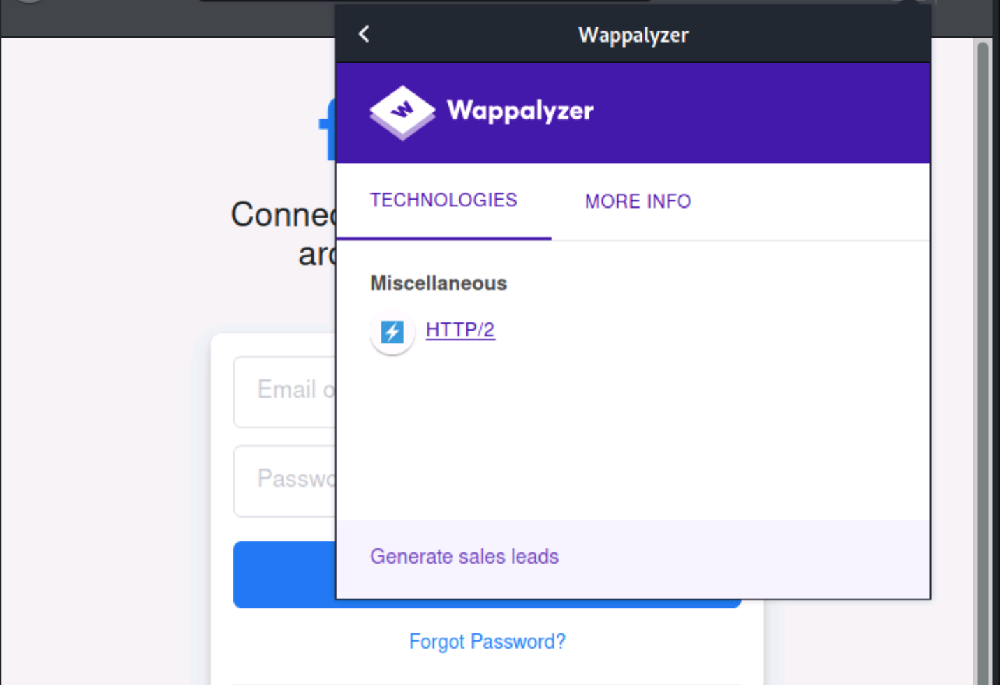

# Enumeración web

Necesitamos descubrir la mayor cantidad de información posible del servidor web para comprender su funcionalidad, lo que puede afectar a las pruebas futuras.&#x20;

Por ejemplo:

* la funcionalidad de reescritura de URL
* el equilibrio de carga
* los motores de script utilizados en el servidor o un IDS (Intrusion detection system)&#x20;

pueden impedir algunas de nuestras actividades de prueba.


### Encabezados HTTP

Lo primero que podemos hacer para identificar la versión del servidor web es mirar los encabezados de respuesta.

```shell-session
pyrhos$ curl -I "http://${TARGET}"

HTTP/1.1 200 OK
Date: Thu, 23 Sep 2021 15:10:42 GMT
Server: Apache/2.4.25 (Debian)
X-Powered-By: PHP/7.3.5
Link: <http://192.168.10.10/wp-json/>; rel="https://api.w.org/"
Content-Type: text/html; charset=UTF-8
```

También hay otras características a tener en cuenta al tomar huellas digitales de los servidores web en los encabezados de respuesta:

* **Encabezado X-Powered-By**: Este encabezado puede decirnos qué está usando la aplicación web. Podemos ver valores como PHP, ASP.NET, JSP, etc.
* **Cookies**: Las cookies son otro valor atractivo a tener en cuenta, ya que cada tecnología tiene por defecto sus cookies. Algunos de los valores predeterminados de las cookies son:
  * .NET: `ASPSESSIONID<RANDOM>=<COOKIE_VALUE>`
  * PHP: `PHPSESSID=<COOKIE_VALUE>`
  * JAVA: `JSESSION=<COOKIE_VALUE>`

```shell-session
pyrhos$ curl -I http://${TARGET}

HTTP/1.1 200 OK
Host: randomtarget.com
Date: Thu, 23 Sep 2021 15:12:21 GMT
Connection: close
X-Powered-By: PHP/7.4.21
Set-Cookie: PHPSESSID=gt02b1pqla35cvmmb2bcli96ml; path=/ 
Expires: Thu, 19 Nov 1981 08:52:00 GMT
Cache-Control: no-store, no-cache, must-revalidate
Pragma: no-cache
Content-type: text/html; charset=UTF-8
```

Otras herramientas analizan las características comunes de los servidores web sondeándolos y comparando sus respuestas con una base de datos de firmas para adivinar información como la versión del servidor web, los módulos instalados y los servicios habilitados.&#x20;

## **Herramientas de enumeración web**

### WhatWeb

Reconoce las tecnologías web, incluidos:

* los sistemas de gestión de contenidos (CMS),
* las plataformas de blogs.
* los paquetes de estadísticas/análisis.
* las bibliotecas de JavaScript.
* los servidores web y los dispositivos integrados.
* Recomendamos leer el menú de ayuda para comprender las opciones disponibles.
* como los controles de nivel de agresión o la salida detallada.

En este caso, usaremos un nivel de agresión de 3 a través de la bandera -a y una salida detallada a través de -v.

```shell-session
pyrhos$ whatweb -a3 https://www.facebook.com -v

WhatWeb report for https://www.facebook.com
Status    : 200 OK
Title     : <None>
IP        : 31.13.92.36
Country   : IRELAND, IE

Summary   : Strict-Transport-Security[max-age=15552000; preload], PasswordField[pass], Script[text/javascript], X-XSS-Protection[0], HTML5, X-Frame-Options[DENY], Meta-Refresh-Redirect[/?_fb_noscript=1], UncommonHeaders[x-fb-rlafr,x-content-type-options,x-fb-debug,alt-svc]

Detected Plugins:
[ HTML5 ]
	HTML version 5, detected by the doctype declaration

[ Meta-Refresh-Redirect ]
	Meta refresh tag is a deprecated URL element that can be
	used to optionally wait x seconds before reloading the
	current page or loading a new page. More info:
	https://secure.wikimedia.org/wikipedia/en/wiki/Meta_refresh

	String       : /?_fb_noscript=1

[ PasswordField ]
	find password fields

	String       : pass (from field name)

[ Script ]
	This plugin detects instances of script HTML elements and
	returns the script language/type.

	String       : text/javascript

[ Strict-Transport-Security ]
	Strict-Transport-Security is an HTTP header that restricts
	a web browser from accessing a website without the security
	of the HTTPS protocol.

	String       : max-age=15552000; preload

[ UncommonHeaders ]
	Uncommon HTTP server headers. The blacklist includes all
	the standard headers and many non standard but common ones.
	Interesting but fairly common headers should have their own
	plugins, eg. x-powered-by, server and x-aspnet-version.
	Info about headers can be found at www.http-stats.com

	String       : x-fb-rlafr,x-content-type-options,x-fb-debug,alt-svc (from headers)

[ X-Frame-Options ]
	This plugin retrieves the X-Frame-Options value from the
	HTTP header. - More Info:
	http://msdn.microsoft.com/en-us/library/cc288472%28VS.85%29.
	aspx

	String       : DENY

[ X-XSS-Protection ]
	This plugin retrieves the X-XSS-Protection value from the
	HTTP header. - More Info:
	http://msdn.microsoft.com/en-us/library/cc288472%28VS.85%29.
	aspx

	String       : 0

HTTP Headers:
	HTTP/1.1 200 OK
	Vary: Accept-Encoding
	Content-Encoding: gzip
	x-fb-rlafr: 0
	Pragma: no-cache
	Cache-Control: private, no-cache, no-store, must-revalidate
	Expires: Sat, 01 Jan 2000 00:00:00 GMT
	X-Content-Type-Options: nosniff
	X-XSS-Protection: 0
	X-Frame-Options: DENY
	Strict-Transport-Security: max-age=15552000; preload
	Content-Type: text/html; charset="utf-8"
	X-FB-Debug: r2w+sMJ7lVrMjS/ETitC6cNpJXma0r3fbt0rIlnTPAfQqTc+U4PQopVL7sR/6YA/ZKRkqP1wMPoFdUfMBP1JSA==
	Date: Wed, 06 Oct 2021 09:04:27 GMT
	Alt-Svc: h3=":443"; ma=3600, h3-29=":443"; ma=3600,h3-27=":443"; ma=3600
	Connection: close

WhatWeb report for https://www.facebook.com/?_fb_noscript=1
Status    : 200 OK
Title     : <None>
IP        : 31.13.92.36
Country   : IRELAND, IE

Summary   : Cookies[noscript], Strict-Transport-Security[max-age=15552000; preload], PasswordField[pass], Script[text/javascript], X-XSS-Protection[0], HTML5, X-Frame-Options[DENY], UncommonHeaders[x-fb-rlafr,x-content-type-options,x-fb-debug,alt-svc]

Detected Plugins:
[ Cookies ]
	Display the names of cookies in the HTTP headers. The
	values are not returned to save on space.

	String       : noscript

[ HTML5 ]
	HTML version 5, detected by the doctype declaration

[ PasswordField ]
	find password fields

	String       : pass (from field name)

[ Script ]
	This plugin detects instances of script HTML elements and
	returns the script language/type.

	String       : text/javascript

[ Strict-Transport-Security ]
	Strict-Transport-Security is an HTTP header that restricts
	a web browser from accessing a website without the security
	of the HTTPS protocol.

	String       : max-age=15552000; preload

[ UncommonHeaders ]
	Uncommon HTTP server headers. The blacklist includes all
	the standard headers and many non standard but common ones.
	Interesting but fairly common headers should have their own
	plugins, eg. x-powered-by, server and x-aspnet-version.
	Info about headers can be found at www.http-stats.com

	String       : x-fb-rlafr,x-content-type-options,x-fb-debug,alt-svc (from headers)

[ X-Frame-Options ]
	This plugin retrieves the X-Frame-Options value from the
	HTTP header. - More Info:
	http://msdn.microsoft.com/en-us/library/cc288472%28VS.85%29.
	aspx

	String       : DENY

[ X-XSS-Protection ]
	This plugin retrieves the X-XSS-Protection value from the
	HTTP header. - More Info:
	http://msdn.microsoft.com/en-us/library/cc288472%28VS.85%29.
	aspx

	String       : 0

HTTP Headers:
	HTTP/1.1 200 OK
	Vary: Accept-Encoding
	Content-Encoding: gzip
	Set-Cookie: noscript=1; path=/; domain=.facebook.com; secure
	x-fb-rlafr: 0
	Pragma: no-cache
	Cache-Control: private, no-cache, no-store, must-revalidate
	Expires: Sat, 01 Jan 2000 00:00:00 GMT
	X-Content-Type-Options: nosniff
	X-XSS-Protection: 0
	X-Frame-Options: DENY
	Strict-Transport-Security: max-age=15552000; preload
	Content-Type: text/html; charset="utf-8"
	X-FB-Debug: 7bEryjJ3tsTb/ap562d5L6KUJyJJ3bJh9XoamIo2lCVrX4cK/VAGbLx7muaAwnyobVm9myC3fQ+CXJqkk0eacg==
	Date: Wed, 06 Oct 2021 09:04:31 GMT
	Alt-Svc: h3=":443"; ma=3600, h3-29=":443"; ma=3600,h3-27=":443"; ma=3600
	Connection: close
```

### Wappalyzer

Es una extensión del navegador. Funciona de manera similar a WhatWeb, pero los resultados se muestran mientras se navega por la URL de destino.




### WafW00f

Es una herramienta de huellas dactilares de firewall de aplicaciones web (WAF) que envía solicitudes y analiza las respuestas para determinar si existe una solución de seguridad. Podemos instalarlo con el siguiente comando.

Opciones relevantes:

* -a : verificar todos los WAF posibles en lugar de detener el escaneo en la primera coincidencia
* -i : leer objetivos de un archivo de entrada
* -p : proxy las solicitudes usando la opción -p

**Identificación de Infraestructura Activa**

```shell-session
pyrhos$ wafw00f -v https://www.tesla.com

                   ______
                  /      \
                 (  Woof! )
                  \  ____/                      )
                  ,,                           ) (_
             .-. -    _______                 ( |__|
            ()``; |==|_______)                .)|__|
            / ('        /|\                  (  |__|
        (  /  )        / | \                  . |__|
         \(_)_))      /  |  \                   |__|

                    ~ WAFW00F : v2.1.0 ~
    The Web Application Firewall Fingerprinting Toolkit

[*] Checking https://www.tesla.com
[+] The site https://www.tesla.com is behind CacheWall (Varnish) WAF.
[~] Number of requests: 2
```

### Aquatone

Es una herramienta para la inspección automática y visual de sitios web en muchos hosts y es conveniente para obtener rápidamente una descripción general de las superficies de ataque basadas en HTTP.

* Escanea una lista de puertos configurables
* Visita el sitio web con un navegador Chrome sin cabeza y tomando una captura de pantalla.&#x20;

Esto es útil, especialmente cuando se trata de enormes listas de subdominios.

#### **Instalación de Aquatone**



### Pasos de instalación (dependencias y obtención)

```shell-session
pyrhos$ sudo apt install golang chromium-driver
pyrhos$ go install github.com/michenriksen/aquatone@latest
pyrhos$ export PATH="$PATH":"$HOME/go/bin"
```



### Opciones de Aquatone

```shell-session
pyrhos$ aquatone --help

Usage of aquatone:
  -chrome-path string
    	Full path to the Chrome/Chromium executable to use. By default, aquatone will search for Chrome or Chromium
  -debug
    	Print debugging information
  -http-timeout int
    	Timeout in miliseconds for HTTP requests (default 3000)
  -nmap
    	Parse input as Nmap/Masscan XML
  -out string
    	Directory to write files to (default ".")
  -ports string
    	Ports to scan on hosts. Supported list aliases: small, medium, large, xlarge (default "80,443,8000,8080,8443")
  -proxy string
    	Proxy to use for HTTP requests
  -resolution string
    	screenshot resolution (default "1440,900")
  -save-body
    	Save response bodies to files (default true)
  -scan-timeout int
    	Timeout in miliseconds for port scans (default 100)
  -screenshot-timeout int
    	Timeout in miliseconds for screenshots (default 30000)
  -session string
    	Load Aquatone session file and generate HTML report
  -silent
    	Suppress all output except for errors
  -template-path string
    	Path to HTML template to use for report
  -threads int
    	Number of concurrent threads (default number of logical CPUs)
  -version
    	Print current Aquatone version
```



### Uso sobre una lista de subdominios

```shell-session
pyrhos$ cat facebook_aquatone.txt | aquatone -out ./aquatone -screenshot-timeout 1000

aquatone v1.7.0 started at 2021-10-06T10:14:42+01:00

Targets    : 30
Threads    : 2
Ports      : 80, 443, 8000, 8080, 8443
Output dir : aquatone

edge-star-shv-01-cdg2.facebook.com: port 80 open
edge-extern-shv-01-waw1.facebook.com: port 80 open
...
Wrote HTML report to: aquatone/aquatone_report.html
```

Cuando termine, tendremos un archivo llamado <kbd>aquatone\_report.html</kbd> donde podemos ver capturas de pantalla, tecnologías identificadas, encabezados de respuesta del servidor y HTML.




