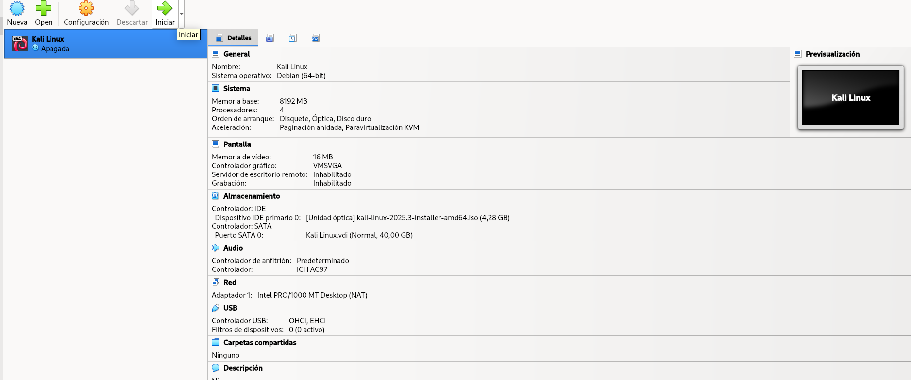

# Instalación de kali linux en VirtualBox

## Parte 1: Configuración de la máquina virtual



### Descargar el ISO de la web del sistema operativo

<figure><figcaption></figcaption></figure>




### Crear una maquina virtual&#x20;

<figure><figcaption></figcaption></figure>




### Configurar los recursos y la memoria para el disco duro

<figure><figcaption></figcaption></figure>




### Iniciar la Maquina

<figure><figcaption></figcaption></figure>




## Parte 2: Instalación de Kali Linux



###




###




