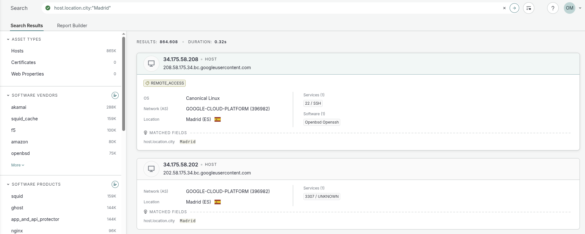

# Censys

**Censys es la plataforma especializada en la búsqueda de amenazas.**

<figure><figcaption></figcaption></figure>



### 🔹 Identidad del Host / Red

**Búsquedas básicas**

* `"texto"` → busca en cualquier campo indexado
* `ip:1.2.3.4` → IP exacta
* `ip:1.2.3.0/24` → rango CIDR
* `services.service_name:"http"` → filtra por protocolo
* `services.port:443` → filtra por puerto

**Certificados**

* `services.tls.certificates.leaf_data.subject_dn:"CN=example.com"`
* `services.tls.certificates.leaf_data.names:example.com`
* `services.tls.certificates.leaf_data.fingerprint_sha256:HASH`

**Organización / ASN**

* `autonomous_system.asn:13335` → ASN
* `autonomous_system.organization:"Cloudflare"`
* `location.organization:"Proveedor"`



### 🔹 Software, Versiones, Banner, HTTP

**Software / Servicios**

* `services.software.product:"nginx"`
* `services.software.version:"1.18.0"`
* `services.service_name:"ssh"`
* `services.banner:"OpenSSH"`

**HTTP / Web**

* `services.http.response.status_code:200`
* `services.http.response.html_title:"Login"`
* `services.http.response.headers.server:"Apache"`
* `services.http.response.body:"texto"`

**Fingerprints**

* `services.jarm.fingerprint:"abcdef..."`
* `services.tls.ja3s:"ja3hash"`

**Hash (contenido exacto)**

* `services.http.response.body_hash:HASH`



### 🔹 Ubicación & Fechas

**Geolocalización**

* `location.country:"US"`
* `host.location.city:"Madrid"`
* `location.province:"California"`
* `location.longitude:>0` / `location.latitude:<0`

**Fecha / Reciente**

* `services.observed_at:>2024-01-01`
* `last_updated_at:<2023-12-01`

**Estado / Existencia**

* `services.tls.certificates.leaf_data.validity.start:>=2023-01-01`
* `services.tls.certificates.leaf_data.validity.end:<2025-01-01`



