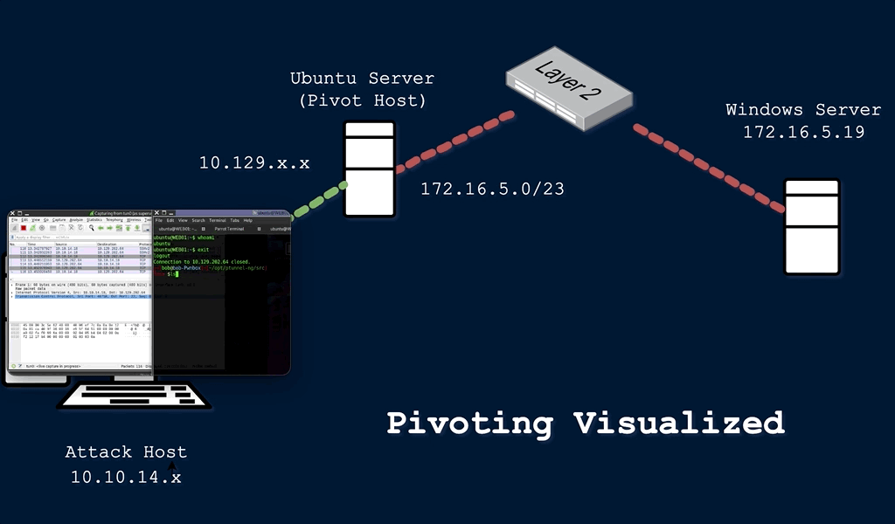

# Introducción

## ¿Que es el pivoting?

El pivoting es una tecnica que nos permite acceder a un host que no es directamente accesible, con una previo compromiso de un equipo a traves de credenciales, access tokens, hashes, ssh keys...

Basicamente el pivoting es movernos a otra red a traves de un equipo comprometido para encontrar nuevos equipos o nuevos segmentos de red.

<figure><figcaption></figcaption></figure>

Hay muchos términos diferentes que se utilizan para describir un host comprometido y que podemos usar para pivotar a un segmento de red previamente inalcanzable. Los mas comunes son:

* `Pivot Host`
* `Proxy`
* `Foothold`
* `Beach Head system`
* `Jump Host` &#x20;

Principalmente el Pivoting sirve para traspasar la segmentacion para acceder a una red aislada.

## Movimiento Lateral, Pivoting y Tunneling

### Movimiento Lateral

Técnica utilizada para expandir el acceso dentro de una red comprometida, accediendo a otros hosts, aplicaciones o servicios internos.

también puede ayudarnos a:

* Obtener acceso a recursos de dominio específicos que podamos necesitar para elevar nuestros privilegios&#x20;
* Conseguir una escalada de privilegios entre hosts.

#### Objetivo

* Ampliar la superficie de acceso dentro de la red
* Acceder a recursos internos adicionales
* Facilitar escalada de privilegios entre sistemas

#### Características

* Se basa en credenciales reutilizadas o accesos válidos ya obtenidos
* Implica desplazamiento entre máquinas dentro del mismo entorno de red
* Frecuente en entornos de dominio (Active Directory)

#### Ejemplo

* Acceso inicial a un host comprometido
* Obtención de credenciales de administrador local
* Escaneo de red interna
* Reutilización de credenciales en otro host
* Compromiso de más sistemas dentro del dominio





### Pivoting

Uso de un host comprometido como punto intermedio para acceder a redes o segmentos de red que no son directamente accesibles desde el punto de entrada inicial.

#### Objetivo

* Cruzar límites de red (subredes o VLANs)
* Acceder a entornos aislados o segmentados
* Expandir alcance hacia redes internas más protegidas

#### Características

* Depende de hosts con múltiples interfaces de red (dual-homed)
* Actúa como “puente” entre redes separadas
* No se centra en moverse entre hosts, sino entre redes

#### Ejemplo

* Compromiso de una estación de ingeniería
* Descubrimiento de que tiene acceso a red corporativa y red OT
* Uso del host como puente para acceder a una red previamente inaccesible

### Tunneling

Técnica de encapsulación de tráfico dentro de otros protocolos para ocultar, transportar o evadir detección del tráfico de red.

#### Objetivo

* Evadir sistemas de detección (IDS/IPS)
* Mantener canales de C2 (Command and Control)
* Exfiltrar datos de forma encubierta

#### Características

* Encapsulación de tráfico en protocolos comunes (HTTP, HTTPS, SSH)
* Puede simular tráfico legítimo
* Puede incluir cifrado (TLS/SSL)

#### Ejemplo

* Encapsular tráfico C2 dentro de solicitudes HTTP GET/POST
* Tráfico que aparenta ser navegación web normal
* Redirección del tráfico válido hacia servidor de controlx

### Comparación General

| Técnica            | Propósito principal                    | Alcance            | Método clave                    |
| ------------------ | -------------------------------------- | ------------------ | ------------------------------- |
| Movimiento lateral | Expandir acceso dentro de la misma red | Entre hosts        | Reutilización de credenciales   |
| Pivoting           | Acceder a redes segmentadas            | Entre redes        | Uso de hosts puente (multi-NIC) |
| Tunneling          | Ocultar o encapsular tráfico           | Lógico (cualquier) | Encapsulación de protocolos     |

### En resumen

* **Movimiento lateral** → expansión dentro de la red
* **Pivoting** → salto entre redes usando un intermediario
* **Tunneling** → ocultación o encapsulación del tráfico
