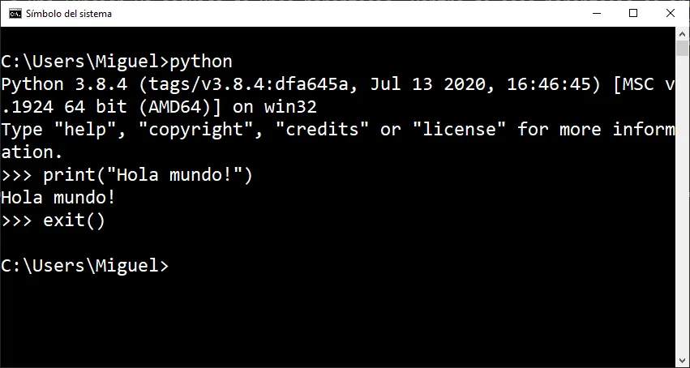

---
metaLinks:
  alternates:
    - >-
      https://app.gitbook.com/s/z0iyBve0fcLSJpEvb9YL/modelos-de-referencia/modelo-osi
---

# interprete de Python

El interprete de Python es el motor que ejecuta el código de los programas en tiempo real.

### Funciones clave

1. Ejecuta el código de los programas linea por linea.
2. Se puede usar en modo interactivo para ejecutar comandos de python y ver los resultados de manera inmediata.
3. Puede ejecutar programas completos o scripts.
4. El intérprete complia el codigo a bytecode antes de ejecutarlo para mejorar el rendimiento.
5. el bytecode se ejecuta en PVM, que hace que el código sea portable.

<figure><figcaption></figcaption></figure>
