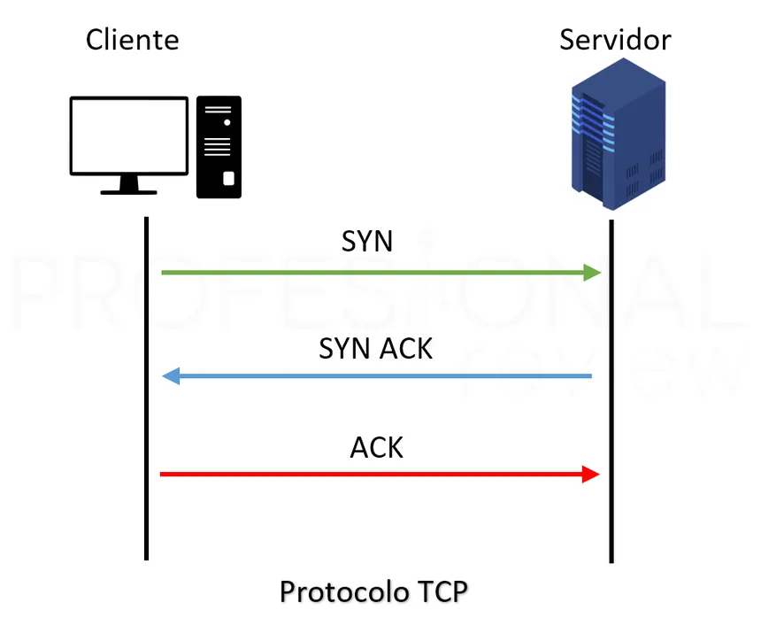

# Protocolo TCP

Es un protocolo orientado a la conexión que asegura la entrega de los datos de manera confiable y ordenada. Se utiliza en navegación web, FTP y SMTP.

* Conexión Orientada
* Fiabilidad&#x20;
* Control de Flujo y Congestión

<figure><figcaption></figcaption></figure>
