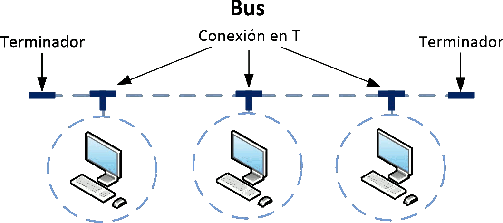
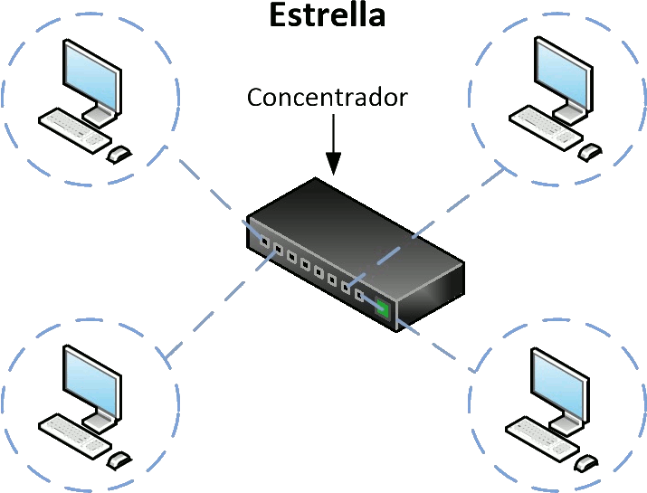
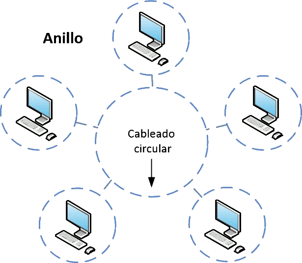
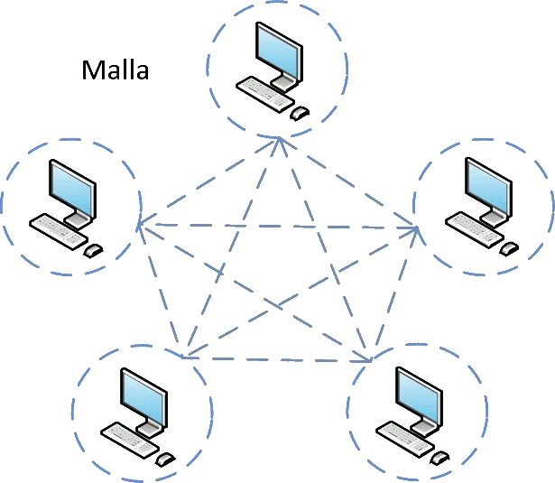

# Topologias de red

> La **topología de una red** describe cómo están conectados sus dispositivos y cómo circulan los datos entre ellos.

Una red de datos está formada por dispositivos conectados entre sí mediante **medios de comunicación**, como cables de red, fibra óptica o conexiones inalámbricas.&#x20;

La disposición física de estos dispositivos y de sus conexiones se denomina **topología física**.

**Las topologias  físicas mas habituales:**



Todos los equipos se conectan a una **misma línea de transmisión**, denominada **bus**. Tradicionalmente se utilizaba cable coaxial.

<figure><figcaption></figcaption></figure>



Todos los dispositivos están conectados a un **nodo central**, normalmente un **switch**.

<figure><figcaption></figcaption></figure>

Es la topología física más utilizada actualmente en las **redes Ethernet de hogares, centros educativos y empresas**.&#x20;



Los dispositivos están conectados formando un **circuito cerrado**, de manera que cada nodo se comunica con otros nodos del anillo.&#x20;

<figure><figcaption></figcaption></figure>



Los nodos disponen de **varias conexiones entre sí**, lo que permite disponer de caminos alternativos para transmitir la información.

<figure><figcaption></figcaption></figure>

Esta estructura aporta una mayor **redundancia y tolerancia a fallos** y se utiliza, por ejemplo, en determinadas **redes inalámbricas malladas**.



**La topología lógica, a diferencia de la física, describe la forma en la que circulan los datos por la red y cómo se comunican los dispositivos entre sí.**

Las topologías lógicas más comunes son:

* **Bus:** los datos se transmiten por un medio compartido y pueden llegar a todos los dispositivos conectados. Cada equipo procesa únicamente la información que le corresponde.
* **Anillo:** los datos pasan de un dispositivo a otro siguiendo el recorrido establecido hasta alcanzar su destino. En algunas tecnologías, el acceso al medio se controla mediante un **turno de transmisión**.
* **Estrella:** la comunicación pasa por un **dispositivo central**, que recibe los datos y los dirige hacia su destino. Es el funcionamiento habitual de una red Ethernet moderna basada en **switches**.

 
